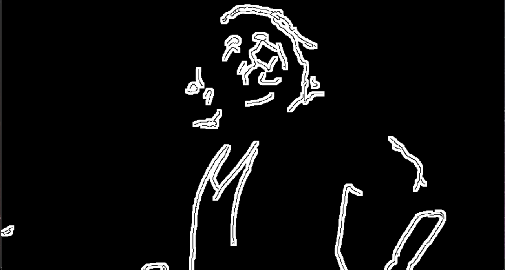
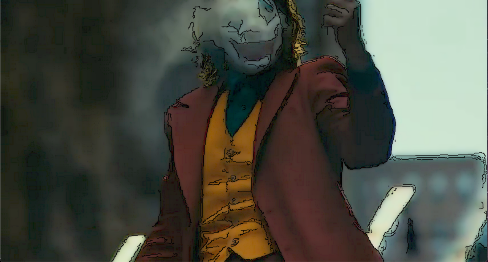

# Make_Vide0_Cartoon
Making video cartoon style by using OpenCV image processing
****

## 개요

ChatGPT에게 OpenCv를 이용하여 영상을 카툰 스타일로 변환하는 코드를 제안합니다 

이후 제안한 코드를 참고하여 자신만의 만화 스타일로 바꾸는 코드를 작성 후 각각의 결과물과 실행 화면을 비교합니다

## ChatGPT가 제안한 코드

1.  동영상을 읽어오는 객체 생성 후 프레임 사이즈와 속도를 가져옵니다

2.  프레임을 일련된 과정을 통해 변환합니다
   - 그레이스케일로 변환 → 케니 엣지 → adaptiveThreshold  → 흰검 반전 →  컬러로 변환(생략가능) → Bilateral 필터 적용
3.  변환한 동영상을 출력합니다
4.  q키를 누르면 프로그램을 종료합니다

## 자신만의 스타일로 변환한 코드

1.  동영상을 읽어오는 객체 생성 후 프레임 사이즈와 속도를 가져옵니다

2.  프레임을 일련된 과정을 통해 변환합니다
   1.  Bilateral 필터 적용 
   2.  프레임에 1을 나누기
   3.  케니 엣지  → 흰검 반전 →  컬러로 변환(생략가능)
   4.  1, 2, 3을 bitwise_and로 결합
3.  변환한 동영상을 출력합니다
4.  ESC키를 누르면 프로그램을 종료합니다

## 실행 결과 비교 

#### 	ChatGPT가 제안한 코드

​	

#### 	자신만의 스타일로 변환한 코드

​	
